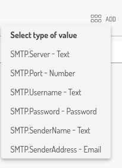
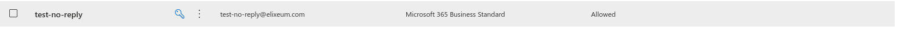
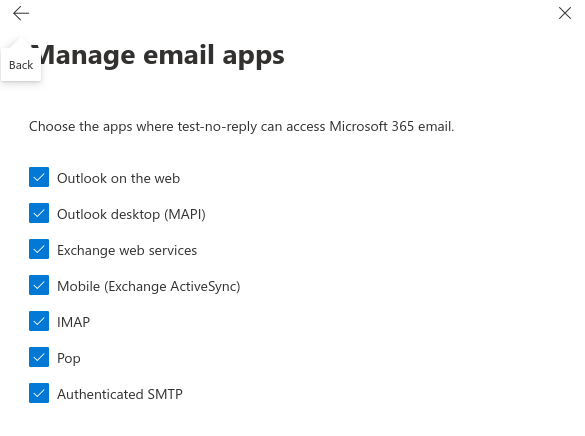

# Notification Email Server (SMTP)

Elixeum portal utilize emails as primary means of communication.
They're sent while creating/registering user, while reseting a user password or can be used for various notification from portal features.

In order for emailing to work, Elixeum provides a default mailbox through which emails are sent, that is **no-reply@elixeum.cloud**

When a customer requires mass emailing feature or wants to customize the mailbox sender address, a custom email server is needed.
Instruction how to configure it are below.

## Configuring a custom email server in Elixeum Portal
Custom SMTP server can be configured the Notification service - the bell icon:

In the Service settings the are fields to configure the SMTP connection. If you don't see desired field, click on the Add button in the top right corner and select the desired key:

Four fields are required to be set in order custom SMTP server to be used:

| Key           | Description                      |
|---------------|----------------------------------|
| SMTP.Server   | SMTP server address or host name |
| SMTP.Port     | SMTP server port (usually 587)   |
| SMTP.Username | Login credential                 |
| SMTP.Password | Password credential              |

_Note: Password is encrypted in the Elixeum portal, when editing the field shows only blank space_

_Note 2: To edit these settings a special permission to manage settings is required._

**When custom SMTP connection is set up, all emails are then sent using this SMTP.**

Currently Elixeum portal supports a basic authentication (login) for SMTP, OAuth based authentication is scheduled in the future releases.

## Allowing SMTP auth in Office365 mailbox

Microsoft has disabled Basic authentication in Office365 accounts so in order to use one for sending emails from Elixeum Portal, SMTP Auth has to be enabled. 

_Note: This requires administration permissions over Office365 accounts_

1. Go to User administration in [Microsoft365 Admin center](https://admin.microsoft.com/#/users)
2. Add a new user if needed
3. Verify that the desired user is **Allowed** to login and **has a valid license**. 
4. Select the user, in the modal window on the side click **Mail** and **Manage email apps**
5. Enable the Authenticated SMTP (check it) 