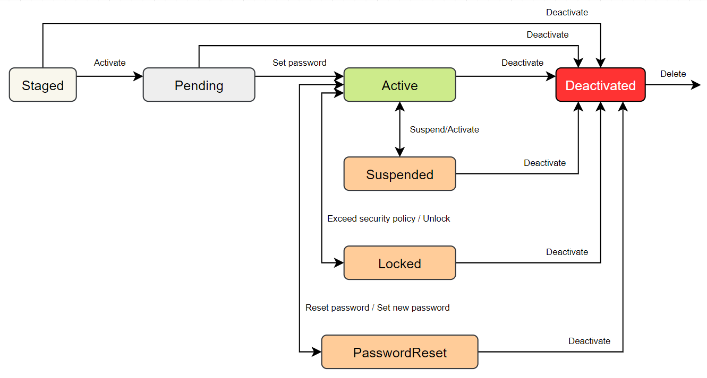

# User

## User states

Status description:

| Status   | Description                                                                                                                                                                                |
|----------|--------------------------------------------------------------------------------------------------------------------------------------------------------------------------------------------|
| Staged:  | The user has not been sent an account invitation email                                                                                                                                     |
| Pending: | The user has been sent an invitation invitation email. You can sign in to your account only after setting a new permanent password.                                                        |
| Active: | User with set password. The user can log in to their account.                                                                                                                               |
| PasswordReset: | A password reset email has been sent to the user. The user will not be able to log in to the account until a new password is set.                                                    |
| Locked: | The user has made more unsuccessful login attempts than the security measures allow. Users in this state cannot log in to their account. Only an administrator can unblock a locked user.   |
| Suspended: | The user has been suspended by an administrator. They will not be able to log in again until an administrator returns this status.                                                       |
| Deactivated: | A user with a disabled state cannot log on to the system and all resources are removed. An administrator can delete deactivated users. When done, they will be removed from the system.|

## User imports

Users can be imported via a CSV file.
The file must follow the given structure exactly, otherwise the import may fail.

File header definition:
<code>titleBeforeName;firstName;lastName;titleAfterName;emailAddress;phoneNumber</code>

File example: [Download](../../assets/users_import_example.csv ':ignore')
