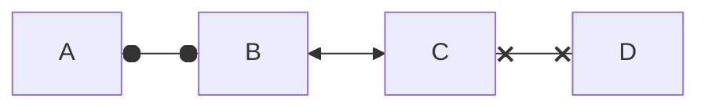

# Rules and Tips for Writing Documentation

First of all - **K**eep **I**t **S**imple **S**tupid - I know, I know that's obvious but really - try to image you are describing the problematic to yourself before you gain that knowledge.

?> Keeping things simple and easy makes great documentation for future readers.

# Formatting

There are several ways how to formate your text including diagrams and code samples - go ahead and inspect code of this page to see it in action!

## Flowchart

[Mermaid](https://mermaid-js.github.io/mermaid/#/) powered flowchart demo.



## Code Samples

Code samples using tabs as well to show samples using different languages.

<!-- tabs:start -->
#### **C#**

Hello C#!

```csharp
ILogger log = this.ServiceByType<ILogger>();
```

#### **JavaScript**

Bonjour JavaScript!

```javascript
let log = this.ServiceByType("ILogger");
```
<!-- tabs:end -->
